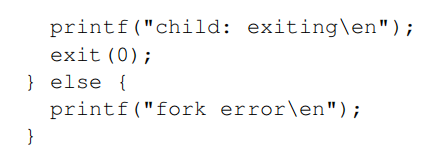

# xv6说明书

xv6：一个简单的类Unix教学向操作系统

作者：Russ Cox，Frans Kaashoek，Robert Morris

翻译自：洛Cold

邮箱：LoanCold@qq.com

由于个人水平和理解能力有限，翻译难免出现错误，以原版为准，非常欢迎email更正错误。

##### 0.译者序

​	xv6有一些废话，也有一些简练的话语。对于前者，译者将进行提炼或者直接略去；对于后者，译者将重新组织文字并添加相应注释。对于一些过于细节的部分（代码、函数介绍等），本书会省略并进行标识，对该部分有需求强烈建议阅读原文。

​	如何阅读？xv6的实验难在技巧性上，因此译者推荐，先明白自己要阅读的是哪一部分，与什么有关，想要知道什么。以文件系统为例，我们一定会先阅读第七章的总览，知道xv6是怎么组织的。然后实验会告诉你需要修改什么内容，那么就可以看看对应的是什么层次。比如发现修改的部分有关inode，那么就要阅读inode层，也就是章节7.8.如果实现的是有关inode的系统调用，就要看文件系统的系统调用的解析，也就是7.14.在阅读过程中不断深入了解，就是xv6实验的目的。

##### 1.操作系统接口

​	操作系统的天职就是将主机的资源共享给不同的程序，并且提供硬件难以带来的功能。操作系统管理并抽象底层硬件，来达到例如让程序能够自如的运行在不同类型硬件上的能力。它同时能够将硬件资源同时分享给不同的程序，来让他们同时（或几乎同时）运行。最后，操作系统提供了规定的方式来让程序能够彼此交互，使得程序之间能够协同工作或者共享数据。

​	操作系统通过接口来为用户程序提供服务。实际上，要想设计一个好的接口可不容易。不仅如此，我们还想让接口精简，这样就更加容易正确的实现。另一些时候，我们可能会执着于给程序提供复杂的特性。要想两者兼得，我们就得设计出精简的机制，但是他们的组合却能够提供无限的可能。

​	本书以这样一个操作系统作为具体的例子来展现操作系统概念。xv6操作系统提供的基本接口是由Ken Thompson和Dennis Ritchie的《Unix Operating System》定义的，同时也模仿了Unix的内部设计。Unix提供了精简的接口，机制之间配合优秀，提供了十分多样的操作空间。这样的接口无疑是优秀的，以至于许多现代操作系统（BSD，Linux，Mac OS X，Solaris以及Windows的一部分）都拥有类Unix接口。而xv6正是一个理解其他操作系统的一个好的开端。

​	

​	正如上图所示，xv6采用了传统的内核（一种特殊程序，用来为程序提供服务）设计。每一个正在运行的程序都被称为**进程**（*process*），它拥有指令、数据以及栈。指令可以实现程序的运行，数据就是运行依赖的变量，栈用来组织程序的步骤调用。

​	当进程需要调用内核的服务时，进程将唤醒操作系统接口中的步骤调用，这种步骤调用称为**系统调用**（*system call*）。系统调用将进入内核，内核执行对应服务然后返回。因此进程将在内核态和用户态中进行交替执行。

​	内核使用CPU的硬件保护机制来确保每一个进程都能在其用户空间中执行，并且仅仅使用自身对应的内存。内核利用硬件特权来实现这些保护机制，用户程序则不能够使用这些特权。当用户程序调用系统调用的时候，硬件就会提高权限指令到特权状态，并且执行预先设计好的内核程序。

​	内核给用户程序提供的一系列系统调用就是用户与内核的接口，这些接口对于用户程序是可见的。xv6内核提供了unix通常拥有的一系列的服务和系统调用。下表列出了所有xv6的系统调用。 

​	

​	本章之后的部分将勾勒出xv6的主要轮廓，包括进程、内存、文件描述符、管道以及文件系统，并辅以一些代码进一步说明。同时，还会讨论shell（一个类unix的基本用户接口）使用以上模块的方法。shell对系统调用的使用实际上也展现了系统调用设计的精妙所在。

​	shell是一个常规的程序，它从用户中读取命令，并执行它。注意，shell是用户程序，不属于内核，没什么好稀奇的，也很容易被其他程序代替。因此，unix系统中还有很多不同的shell（颜色、特性等）。xv6的shell是Unix Bourne shell的简单翻版。shell具体代码见sh.c

​	

###### 1.1进程和内存

​	一个xv6的进程包括用户内存（指令、数据和栈）以及独立于内核的每个进程的状态。xv6可以分时执行进程，在用户不知情的情况下切换可用的CPU来执行等待的进程。当进程等待时，xv6保存CPU的寄存器，在之后运行的时候再恢复。内核用(pid)属性来唯一标识每个进程。

​	进程可以使用系统调用[fork]来创建新进程。新的进程叫做“子进程”，和调用[fork]的进程（称为“父进程”）有着完全一样的内存数据。系统调用[fork]会返回两个值，在父进程中返回的是子进程的pid，而子进程中返回的是0。一个实例程序如下。

​	[exit]系统调用让进程停止执行，并且释放占用的内存空间和打开的文件。该调用需要一个整形参数，0表示成功，1表示失败。系统调用[wait]返回退出的子进程的pid，并且将退出的状态（刚刚谈到的整型参数）复制到调用[wait]时赋予的指针参数上。如果之前没有子进程退出，那么就会一直等待直到有子进程退出。如果父进程不在乎子进程退出的状态，传入的参数为0即可。

​	<!--xv6英文版此处为代码讲解部分，译者认为不算重要，因此翻译版只简要讲述一部分，内容不全（之后类似状况简写为内容不全）。英文版对应12页-->

​	[exec]系统调用将新的内存镜像（来自文件系统的文件数据）覆盖调用进程的内存。这个新的文件数据必须为特定的格式，要求指明什么是指令部分，什么是数据部分，指令从哪开始等等。xv6使用了ELF格式，在第三章将有详细的讲解。当[exec]执行的完后，将不会返回原来的程序，而是从ELF头文件指定的起始处开始执行。一个示例如下。

​	这里，实例程序是/bin/echo，参数列表是argv，通常程序会忽略第一个参数，因为这通常是程序的名字。

​	xv6的shell就使用了如上的系统调用代表用户运行程序。shell的主程序十分简单，即*user/sh.c:145* 程序文件中的[main]函数。简单来说，shell先收到用户输入的命令，之后[fork]以执行再调用[getcmd]解析命令，成功就执行对应程序，程序结束完之后自身会调用[exit]，主程序会使用[wait]等待执行结束。

​	xv6并没有多用户的设定，按照unix术语来说，就是所有用户都是root用户。

###### 1.2 I/O和文件描述符

​	”文件描述符“是一个整数，用来描述内核管理的个体，可写可读。进程可以通过打开文件、目录、设备或者复用已有的文件描述符，来获得一个文件描述符。为了简单，我们经常将文件和文件描述符等价起来。每次分配新的文件描述符的时候，都是寻找当前未用的最小的文件描述符来使用。

​	在内部，xv6内核的文件描述符实际上是每个进程表中的索引，因此每个进程私有一块空间，存储从0开始的文件描述符。事先约定，文件描述符0表示标准输入（可读），1表示标准输出（可写），2表示标准错误（可写）。没错，shell就是利用该约定进行了I/O和管道的重定向。shell运行时，保证当前有且仅有三个文件描述符打开。

​	<!--xv6英文版此处为系统调用讲解部分（open/close/read/write/dup），译者认为不算重要，因此翻译版只简要讲述一部分，内容不全。英文版对应14页。-->

​	[fork]会完整复制打开的文件描述符以及对应的内存。[exec]在覆盖原有的数据时，仍然保留原来的文件表。因此，I/O重定向可以通过先fork再重新打开所选的文件描述符，然后exec新程序来实现，这也是将fork和exec分开的原因之一。比如实现"*cat < input.txt*"：

​	值得注意的是，即使fork会使得文件描述符复制一份，但是文件的偏移量则是共享的。<!--想象一下，如果不共享，父子进程都write(fd=1)的时候，也就是输出至屏幕上的时候，会怎样。这也意味着fork只是dup而不是open文件-->我们现在对上面的例子再扩展一下，实现"*(echo hello; echo world) >output.txt*"，这怎么办？还好有[wait]，我们可以串行的执行命令，执行一步解析一步，而不是所有的都解析完后再进行执行。

​	再来看看dup和open的区别，dup实际上是复制指针，两个文件描述符共享一个空间，彼此的修改都会改动彼此的文件信息和状态。但是open则是重新创立空间来保存文件状态（而不是文件的完整数据）。举一个例子，文件偏移，dup保持一致且互相影响，而open初始化为0不互相影响。仍然感到困惑可以阅读源代码或者直接阅读对应的具体章节。

​	总之，文件描述符是一个很有用的抽象，它隐藏了其所代表的细节：文件、设备还是管道。

###### 1.3管道

​	管道，即小型内核缓存，它提供给程序一对文件描述符，分别用来读写。将数据写入管道的一端，然后从另一端读取数据，这提供了一种进程间沟通的方法。

​	来看一个程序"wc"的例子：

​	父程序将数据写入管道，子程序将标准输入换成管道出口，使得[wc]的输入都来自管道。

​	注意，如果读取管道时，没有数据缓存，那么就会一直等到有数据或者管道的所有写入的文件描述符都被关闭（这种情况返回0，就像读取文件末尾）。上面的例子在write后马上关闭了管道，这使得[wc]不会一直等待新的输入，要不然程序将陷入永远的等待。<!--关掉！关掉！一定要关掉！-->

​	xv6的shell也支持管道命令，比如："*grep fork sh.c | wc -l*"。竖线"|"左边的输出将作为右边的输入。与刚刚给出的代码实现类似，shell首先fork，分别对左边命令和右边命令运行runcmd。当然，右边的命令也可以包含管道，这样的话又要左右拆分并用管道通信，以此类推，递归的按照左右执行即可。实际上管道也可以被替换成一个临时文件，利用重定向将文件作为媒介进行数据传输。

​	那，为什么还要用管道呢？因为管道至少有四个优点：

- 自清理：用临时文件传输数据还得注意管理临时文件的删除等，管道用完就丢。
- 传输任意大小数据流：临时文件还得考虑所占空间。
- 并行：临时文件还得保证互斥使用，管道可以并行创建多个。
- 进程间高效通信：使用管道比临时文件的读写更为高效。

###### 1.4文件系统

​	xv6的文件系统分成两个部分：无解释的字节流、目录（包括有名字的文件和其他的目录）。这些目录形成了树，从“根目录”开始，路径表示为例如”/a/b/c“来表示”根目录下的目录a 下的目录b下的 文件或目录c“如果不以”/“开头，那就表示相对路径，从当前的目录下开始寻找。

​		<!--内容不全提醒，英文版对应17页。-->	

​	函数[chdir]用来改变当前目录（也就是cd），[mkdir]用来创建目录，[mknod]用来创建一个空的设备文件，需要穿入两个参数major device number 和 minor device number，以唯一确定内核设备。<!--major device number可以看作是设备驱动程序，minor device number则看作是其中的具体的一个设备-->在对设备文件使用系统调用[read] [write]进行读写的时候，内核不会交付给文件系统，而是交付给设备处理程序处理。

​	现在把目光放回系统调用[[fstat]](#syscall)，该系统调用返回文件描述符指向文件的具体信息，具体信息的结构体格式如下：

​	一个文件只有一个名字，但是(inode)却可以拥有多个名字。系统调用[link]新建文件并绑定至已有的inode上。绑定后对两个文件的操作就是对一个文件进行操作。每个inode都有一个独一无二的序号标识，这样调用[fstat]就可以判别两个文件是否真正相同（inode相同）。系统调用[unlink]就是去除这样的重复inode引用，当没有文件引用inode时，其对应的空间就应该被释放。

​	xv6的shell将[rm],[mkdir],[rm],[ln]等文件系统操作作为用户态的程序，这样就可以轻易的在上面做一些加工处理，这似乎看起来理所当然，但实际上有操作系统将这部分放在内核。

​	再对[cd]多说几句，之前谈到shell先fork再runcmd，但是对cd行不通，因为它必须改变父进程当前的路径，因此不能fork，单独处理。

###### 1.5实战

​	

​	

##### 4.陷阱以及设备驱动

​	Xv6一共有三种会造成CPU停止当前执行转向其他特殊操作以解决之前执行出现的问题的操作：

- 系统调用：用户程序执行[ecall]。
- 异常：用户态或者内核态执行零除或使用无效虚拟地址等类似非法操作。
- 设备中断：类似磁盘处理读写结束的情景。

​	该书用“**陷阱**”一词来描述这种情形，典型地，当程序跳转至陷阱操作并结束的时候，程序应该对此无所感知。也就是说，这是透明的，这对中断非常重要，因为中断通常无法预料。正因如此，陷阱操作的正常流程为：

- 陷阱操作强制程序转为内核态
- 内核保护现场（寄存器和其他状态）
- 内核执行对应陷阱操作
- 内核恢复现场
- 返回原来程序

​	Xv6内核将处理所有陷阱操作。对系统调用来说，无可厚非。对中断来说，它要求用户程序不能直接使用外设，所以只有内核才能处理外设。对异常来说，xv6将杀死异常进程，因此也要在内核态。

​	Xv6陷阱有四种处理办法：

- CPU硬件处理
- 向量法
- handler
- 系统调用或者设备驱动服务

​	即使用一种方法足够，但是用向量法和handle应对三种情况（内核陷阱、用户陷阱、时钟中断）显得更为方便。

​	本章将以设备驱动结束。即使这与陷阱主题不同，但是其解决方法通常使用中断法，这与陷阱解决方法类似。

###### 4.1RISC-V陷阱机制

​	RISC-V支持一系列的控制寄存器，内核以此告知对应CPU应该如何处理中断，同时内核也可以通过其中的信息判断某个中断是否发生。*riscv.h*文件包含了xv6定义，下面介绍最常用的控制寄存器：

- stvec:陷阱处理函数地址（内核写入），RISC-V将跳转于此以处理陷阱。
- sepc:当陷阱发生时，RISC-V将pc保存于此（此时stvec将替换pc，以 处理陷阱）。函数[sret]将拷贝(sepc)至(pc)，内核可以通过改变(sepc)来改变调用[sret]时程序的走向（返回的位置）
- scause:陷阱缘由（RISC-V写入）
- sscratch:陷阱handler程序开头（RISC-V写入)
- sstatus:"SIE"比特位表示中断是否开启。内核清零该位，RISC-V将推迟中断直到该位重新有效。"SPP"比特位表征陷阱来自user模式还是supervisor模式，以控制[sret]返回的位置。

<!--RISC-V架构定义了3种工作模式，又称为特权模式（Privileged Mode）。Machine Mode：机器模式，简称M Mode。Supervisor Mode：监督模式，简称S Mode。User Mode：用户模式，简称U Mode。-->

​	以上所述中断handler在supervisor模式处理，不能在user模式读写。同样地，在machine模式，也有一系列控制寄存器被用来处理中断，只不过它们仅仅被用作是时钟中断的特殊情形。在处理非时钟中断时，RISCV处理陷阱步骤如下

1. 如果是设备中断，中断SIE比特位无效，则什么也不做。
2. 清零SIE位
3. pc->sepc
4. 将当前模式保存在SPP
5. 设置(scause)，以反应终端类型
6. 进入supervisor模式
7. stvec->pc
8. 开始执行对应程序

​	需要注意的是，CPU将一次完成上述所有操作。假设其中有一个步骤未执行，例如pstvec->pc，那么程序将以监督模式运行用户程序。这会打破内核与用户的分界，比如用户就可以更改satp寄存器（根页表地址）。因此内核精确控制陷阱入口非常重要，而不是进入一个用户程序来处理陷阱。

​	考虑到CPU不会切换到内核页表，也不会切换到内核栈，更不会保存pc外的任意一个寄存器。因此内核必须在必要时自己处理这些操作。这样做的一个原因是cpu只会执行陷阱中最基本的操作，给予软件充分的灵活性。比如，如果不需要页表的转换就可以完成陷阱操作，相比之下就可以增加性能。

###### 4.2内核态“陷阱”

​	当xv6内核正在运行时，有两种陷阱：异常和设备中断（没有系统调用）。<!-- 注意，内核态陷阱是从内核到内核，之前运行的进程已经在内核运行中了 -->

​	当内核运行时，(stvec)指向[kernelvec]汇编代码地址。因为现在xv6已经在内核态了，（kernelvec)依据当前内核的(satp)和栈指针来保存所有寄存器，以保证最终结束中断时能够正常返回。

​	[kernelvec]将内核中断线程的寄存器保存在栈中。这样做的意义是确保这些寄存器能够正确的保存下来，在今后的线程切换的时候也不会出错（线程切换会转移到新的栈，这使得原来的寄存器能够保留在原来的栈中）。

​	在保护完寄存器后，[kernelvec]将跳转至[kerneltrap]。[kerneltrap]首先将调用[devintr]来确认并处理设备中断。如果不是设备中断，那么就是异常，表示系统出错。

​	当时钟中断引起了[kerneltrap]，同时内核线程正在运行，[kerneltrap]将调用[yield]让出当前线程<!-- 这是一种线程时段轮换调度方式噢！ -->之后线程将转移，陷阱恢复（第六章具体讲解yield）。

​	当[kerneltrap]结束后，就需要恢复原程序。[yield]可能会改变(sepc)以及(sstatus)，因此[kerneltrap]在运行前将其保存起来，运行结束后将其还原，并再次进入[kernelvec]以还原当初保存的内容并且调用[sret]（功能sepc->pc）返回原程序。

​	动动脑筋，想想在[kerneltrap]调用[yield]后，陷阱是怎样返回的源程序的。

​	xv6在cpu从用户态进入内核态的时候，会设置cpu中的(stvec)为[kernelvec]入口。<!-- 译者看了一下代码，发现xv6只有在初始化系统本身的时候才会执行该操作，之后应该不会执行了（也许是看错了） -->注意到实际上有一小段时间，内核在(stvec)为错误值的时候仍然在正常运行，这时候关闭中断尤为重要。还好RISCV天生自带执行陷阱之初中断关闭，并且直到设置(stvec)后才开启中断。

###### 4.3用户态“陷阱”

​	陷阱会因为用户态程序调用系统调用、非法操作、设备中断而发生。函数[uservec]是使用汇编编写的陷阱程序，没有c语言代码，一切陷阱都开始于此，然后用户态陷阱将进入[usertrap]，之后使用[usertrapret]准备返回用户态，最终调用汇编[userret]进行返回。

​	用户态陷阱相比内核态陷阱显得更为棘手，属性(satp)指向没有映射到内核的用户页表项，同时栈指针也可能含有无效或者恶意的内容。

​	由于RISC-V的硬件不会在陷阱中自动切换页表，我们需要在用户态页表内设置一段(stvec)所在的页表项。不仅如此，陷阱向量必须将*satp*转向内核态页表，同时为避免崩溃，内核态页表应该也要包含与之前提到的(stvec)一致的页表项。

​	为了满足这一限制，xv6定义了(trampoline page)涵盖此页表项，其在内核和用户态的虚拟地址都相同，而且对于每一个用户程序，都相同。这个虚拟地址叫做TRAMPOLINE，它对应地址存放的是[trampoline.S]的代码，用户态程序执行时(stvec)指向[uservec]。

​	<!--下面讲述uservec实现-->

​	当[uservec]开始执行时，每一个寄存器都是之前程序的值，但是要想保存这些寄存器又需要改变这些寄存器（用来设置(satp)和寄存器保存地址）才能实现。还好RISC-V有(sscratch)帮我们。[uservec]开头的csrrw指令能够帮助我们互换(a0)和(sscratch)的内容。执行后，就可以利用(a0)来进行之后的操作了。

​	[uservec]的下一步是保护用户寄存器。在进入用户空间之前，内核在(sscratch)中放置了(trapframe)地址（用来保存所有用户寄存器的地方）。由于现在(satp)仍然存放用户态页表，因此(trapframe)内存放的地址也要预先在用户页表进行映射。这和之前的TRAMPOLINE类似，在创建进程的时候就分配对应页表项TRAPFRAME，其虚拟地址在TRAMPOLINE的正下方。进程的p->tf<!-- 这个在proc的结构体中有定义，是进程的一个属性 -->指向的正是(trapframe)，虽然内核页表也可以直接访问它的物理地址。

​	回到正轨，互换(a0)和(sscratch)的内容后，现在(a0)存放的是(trapframe)，那么[uservec]就可以将所有的寄存器保存这里，包括被置换到(sscratch)的(a0)。

​	(trapframe)包含了当前进程的内核栈、当前cpu的hartid、用户态陷阱地址以及内核页表地址。[uservec]将找到对应数据，切换(satp)至内核页表，并且调用[usertrap]。

​	<!--下面讲述usertrap实现-->

​	就如[kerneltrap]一样，[usertrap]的工作就是找到陷阱原因，处理它，然后返回。正如上面提到的，它首先在[kernelvec]改变(stvec)以处理内核陷阱<!--没错，usertrap调用的是kernelvec-->，之后保存(sepc)。判定陷阱类型，是系统调用就交给系统调用，是设备中断就交给[devintr]，最后就只可能是异常，那就杀死进程。当执行系统调用的时候，执行的是指针后一个指令，因为RISC-V在执行系统调用的时候，会会把程序指针指向[ecall]指令。之后，[usertrap]判断进程是否杀死或者是否应该切换（这对应时钟中断）。

​	返回到用户空间的第一步就是调用[usertrapret]，该函数配置了RISC-V的一系列控制寄存器，为将来的用户陷阱做准备，包括将(stvec)改成(uservec)、准备trapframe和将(sepc)设置为之前保存的pc。最后[usertrapret]调用处于TRAMPOLINE页表项区域的[userret]（因为内核页表和用户页表都拥有它）以切换页表。

###### 4.4时钟中断

​	xv6拥有时钟中断功能，并且在计算类型的进程中将其打开，[yield]负责执行转换。每隔一段时间，RISC-V中每个CPU的时钟硬件将产生时钟中断。

​	时钟中断是在机器模式而非监督模式产生。在机器模式中，程序的执行并不需要页表，而且使用一套独立的控制寄存器，所以xv6不能在机器模式运行。因此，xv6需要与之前用户陷阱和内核陷阱完全不同的机制来解决这个问题。

待续

###### 4.6代码解析：系统调用参数

​	之后的章节将详细介绍每个系统调用的实现，而该章节有关系统调用的机制。当然，我们还有最后一点没有介绍：系统调用参数问题。

​	RISC-V的C语言调用规则是：用寄存器传递参数。在系统调用的过程中，这些寄存器（调用时参数）保存在(trapframe)，也就是p->tf。三个函数[argint], [argaddr], [argfd]将搜寻第n个系统调用参数，分别类型为整数、指针和文件描述符。他们都将调用[argraw]来获取寄存器。

​	有些系统调用传递指针参数，而内核必须使用这些指针来读写内存。以系统调用[exec]为例，它给予内核一个指针数组指向用户空间中的字符串参数。这些指针引起了两个问题。

- 问题一：用户程序可能是恶意的，传递无效指针或者欺骗内核以获取内核数据。
- 问题二：内核页表和用户页表不同，因此内核不能使用原始指令进行用户地址内存读写。

​	为了应对，xv6定义了一些函数来安全的从用户空间读取数据（比如[fetchstr])。

待续

##### 6.调度

​	大多数操作系统都支持多进程，因此调度进程切换很有必要。常用方法是：让每一个执行的进程都认为自己在独占虚拟cpu。本章专注于多进程的实现。

###### 6.1多进程

​	xv6在两种情况进行进程的切换。

- 当前进程等待I/O时、等待子进程结束或者在等待[sleep]结束。
- 周期性强制切换长时间满负荷运行的进程。

​	

​	要想实现上述机制，还得解决一些实际问题。xv6已经尽量简洁地解决它，但是还是需要一些小技巧才能真正实现。

- 问题一：如何切换进程？尽管思想简单，但xv6相关实现晦涩难懂。
- 问题二：如何保证让用户程序毫无感知的情况下进行切换？xv6在时钟中断的帮助下，使用标准的上下文切换方式实现。
- 问题三：多个cpu可能同时在切换进程，因此需要建立锁机制。
- 问题四：xv6需要帮助进程结束时完全释放对应空间（因为自己无法完全释放自己）。
- 问题五：多处理器中的每个核都必须知道自己正在运行哪个进程，这样系统调用就可以正确的设置内核状态。
- 问题六：进程可以使用[sleep]和[wakeup]主动控制进程切换。要小心其中的竞争关系，避免wakeup信号的丢失。

###### 6.2代码解析：上下文切换

​	这幅图展示了进程切换的大体流程。

##### 7.文件系统

​	文件系统的天职是组织并存储数据。通常，它还支持在不同用户和应用之间共享数据，并且在系统重启之后还能保持原有数据。

​	xv6的文件系统的文件、目录以及路径名和Unix相似，并且将其文件保存在虚拟磁盘以实现数据永久存储。文件系统地址需要解决以下问题：

- 文件系统需要在磁盘上建立对应的数据结构，以表示目录和文件的树状结构，记录文件块的身份，还有空闲块的位置。

- 文件系统必须支持错误恢复。这表示在系统崩溃时，文件系统在系统重启之后还能正常工作。系统崩溃可能会使得一系列的更新或者磁盘上的数据结构不完整（比如可能会出现文件在被标记为使用的同时，又被标记为空闲块）。

- 不同进程可能会同时对文件系统进行操作，因此文件系统需要对进程进行协调，来保证正确性。

- 访问磁盘远远慢于访问内存，因此文件系统必须含有缓存，以保存常用块。

  现在，让我们来一个一个解决这些问题。

###### 7.1总览

​	

​	xv6的文件系统拥有七级结构：

- 磁盘层：在虚拟硬件设备上读写数据块。
- 缓存层：缓存并同步访问数据块，确保同时一个数据块只允许有一个内核进程进行修改。
- 记录层：

###### 7.8inode层

​	*inode*有两个意思：

1. 硬盘数据结构：保存有文件大小以及一系列数据块。
2. 内存数据结构：在硬盘数据结构之外，还包含有内核的一些额外消息。

<!-- 目录项（directory entry）是什么？它存放在数据块，表示一个目录之下的数据，他们拥有统一的数据结构。通俗来说，目录下还会有目录和文件，每个目录和文件都用目录项来标识，所以叫“entry”，也就是一个入口。如果感觉译者说的不是很清楚，可以试着baidu或者google以下噢！（搜中文） -->

​	硬盘中的inode连续存放在一块叫做“inode块”的区域。每个inode大小相同，拥有自己的序号n，叫做i-number。

​	硬盘中的inode被定义为结构体(dinode)

- 属性type：（0表示空闲）用来区分文件、目录和特殊文件（设备）。
- 属性nlink：记录了它之下管理有多少个目录项，这样可以知道什么时候该释放inode和对应数据块的空间。
- 属性size：记录了文件的字节大小。
- 属性数组addrs：记录了一系列文件内容数据块所在地址。

​	内核将一些活跃的inode保存在内存之中，是硬盘中对应inode的复制品，被定义为结构体(inode)。只有在C语言指针指向该inode的时候，内核才会在内存中保存它。属性ref记录了C语言中有多少指针指向它，为0的时候就释放内存的inode。负责ref改动的两个函数分别为[iget]（获取指针）与[iput]（释放指针）。这些指针来自文件描述符、运行的目录以及内核代码某些临时的需要。

​	在inode实现代码中，有四种锁机制（或者类似的机制）。

1. icache.lock：保证一个inode最多在缓存中出现一次，并且保证inode的ref属性正确表示指针数目。
2. 内存inode自带锁：每个内存inode都有一个lock属性，这个自旋锁保证了访问inode时能够保证互斥性。
3. inode ref：如果其值大于0，那就将其保留在内存中，不要再次从内存取出（对其数值的修改也应该要互斥）。
4. inode的nlink属性：如果其值大于0，表示其管理着多个目录项，inode不应被释放。

​	被[iget()]返回的inode结构体指针直到调用[iput()]之前都一直保持有效。有效还意味着inode不会被删除，也不会出现两个一样的inode。[iget()]提供对inode的非独家访问，允许多个指针同时指向同一个inode。

待续

###### 7.14代码解析：系统调用

​	有了下层抽象，想要实现对应的系统调用就简单多啦，下面我们对一些系统调用来进行进一步的分析。

​	<!-- link和unlink是硬连接对应的实现，其意义可以参考：https://blog.csdn.net/lixinxin65535/article/details/26178369 -->

​	[sys_link] [sys_unlink] 编辑目录来创建或移除inode的目录项<!-- 之前提到的nlink就是实现这个的相关属性 -->。这也是体现”事务“模型优势的另一个例子。[sys_link]首先获取两个参数，字符串(old)与(new)，这里假定前者一定存在，并且不是一个目录，之后实现它的(ip->nlink)计数。然后，[sys_link]调用[nameiparent]来获取(new)最终路径对应的元素以及其父目录。接着，在此创建一个新的目录项并指向原来的(old)对应的inode节点。(new)的父目录必须存在，而且还得与(new)对应的inode在同一块硬盘上，否则报错并清除之前nlink计数操作。